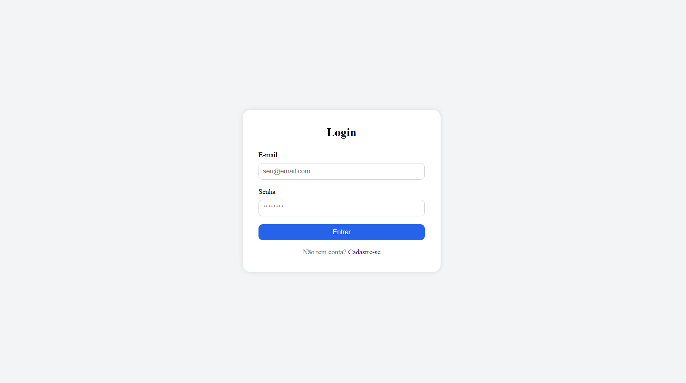
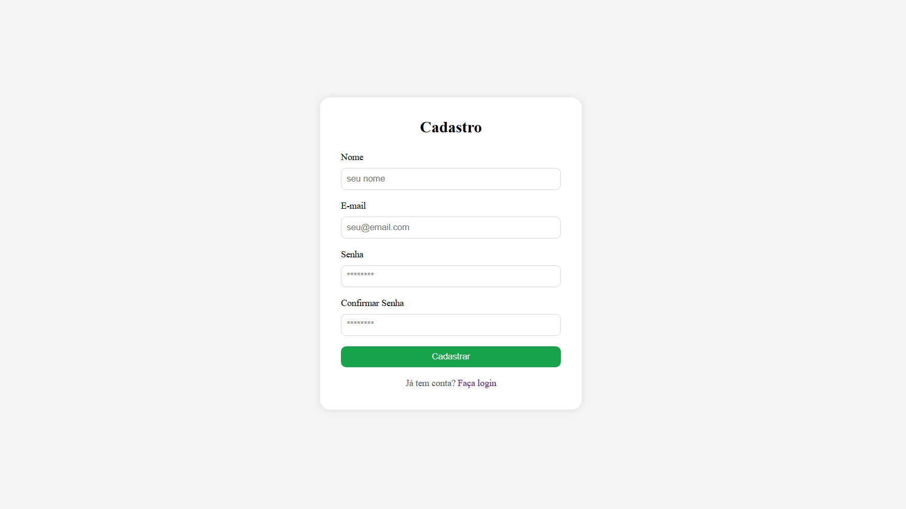
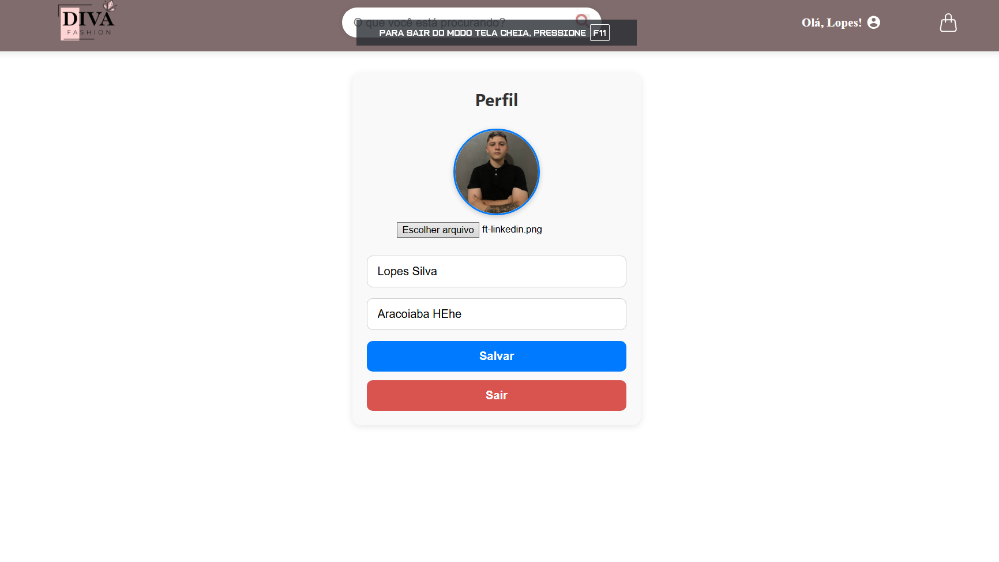
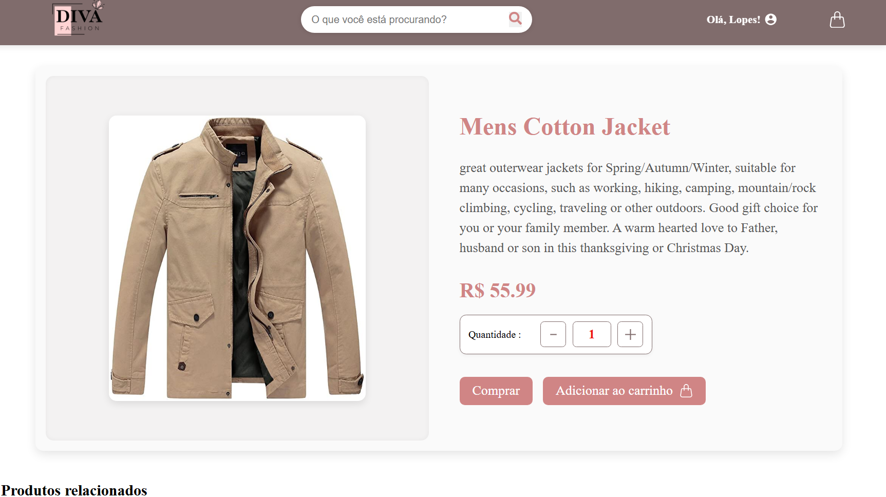
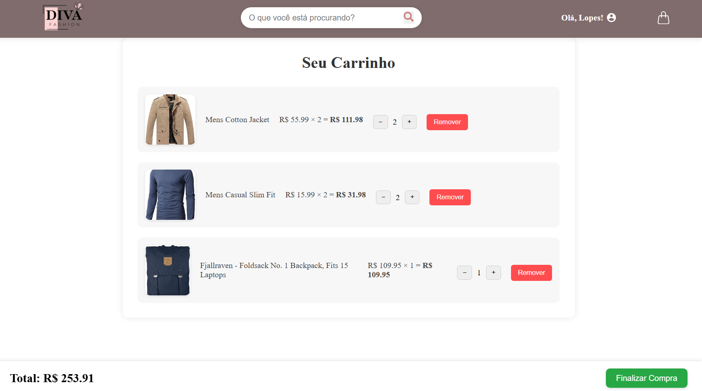

# 🛍️ Loja Diva

Projeto desenvolvido com **React** simulando uma loja de roupas online, com funcionalidades completas de **compra**, **login/cadastro**, **perfil customizado** e integração com o **Firebase**.

<p align="center">
  
</p>

## 🔗 Acesse o Projeto

➡️ [https://github.com/GustavoLopesDev/loja_diva](https://github.com/GustavoLopesDev/loja_diva)

---

## ✨ Funcionalidades

- 🛒 Adicionar produtos ao carrinho
- 💳 Finalizar compra (simulação)
- 🔐 Área de login e cadastro com Firebase
- 👤 Perfil do usuário com Customizável
- 🔎 Busca de produtos
- 📱 Design responsivo

---

## 🚀 Tecnologias utilizadas

| Tecnologia                                                                                                                              | Descrição                       |
| --------------------------------------------------------------------------------------------------------------------------------------- | ------------------------------- |
|                                        | Biblioteca principal do projeto |
|                               | Autenticação e banco de dados   |
|                  | Rotas da aplicação              |
|                                        | Requisições HTTP                |
|                                     | Slides de produtos              |
|  | Estilização customizada         |
|                                           | Bundler usado no projeto        |

---

## 🖼️ Screenshots

### 🏠 Página Home


### 🔒 Tela de Login e Cadastro




### 🛍️ Página de Perfil



### 🛒 Tela do Produto



### 🛒 Carrinho de Compras



---

## ⚙️ Como rodar o projeto localmente

### ✅ Pré-requisitos

- Node.js instalado
- Git instalado

### 👣 Passo a passo

```bash
# 1. Clone o repositório
git clone https://github.com/GustavoLopesDev/loja_diva.git

# 2. Acesse o diretório
cd loja_diva

# 3. Instale as dependências
npm install

# 4. Configure seu Firebase no arquivo de configuração (src/firebase.js)

# 5. Inicie o projeto
npm run dev
```
